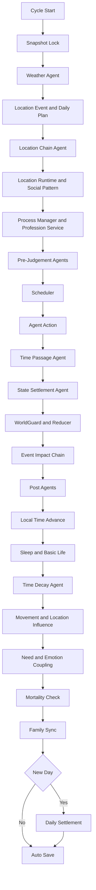
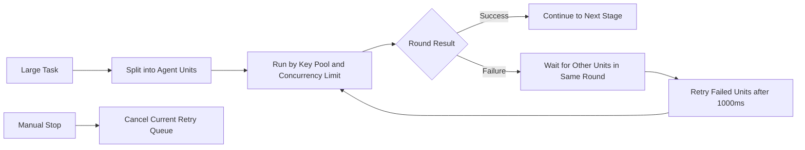
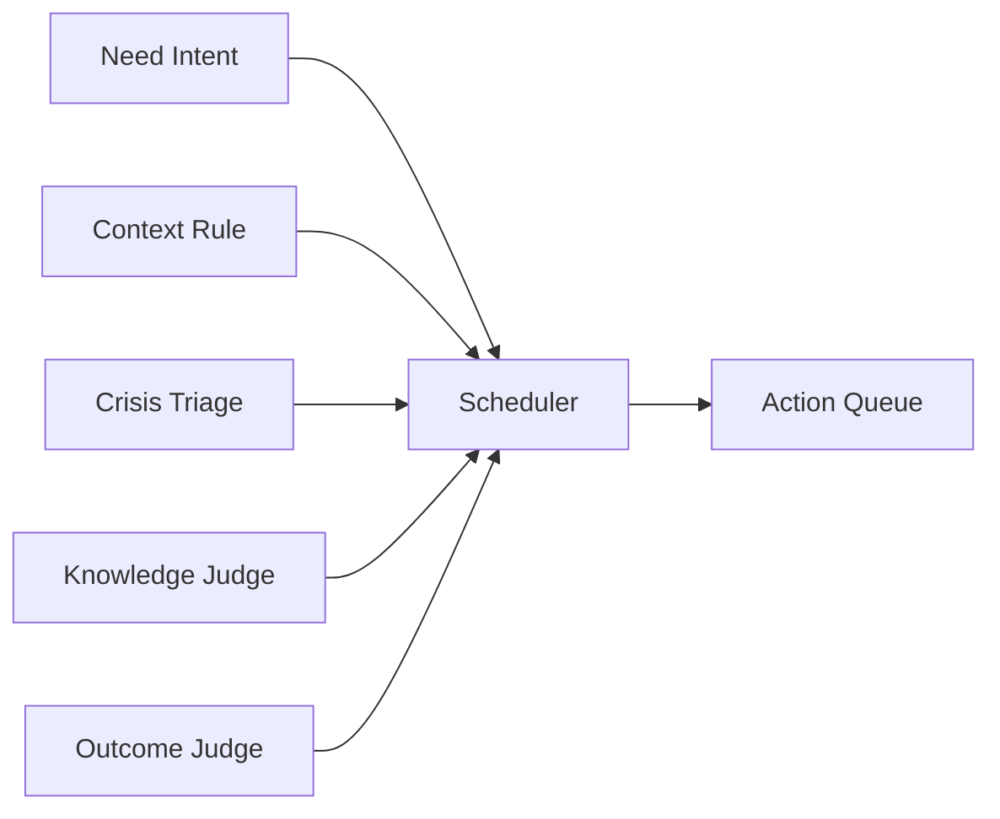
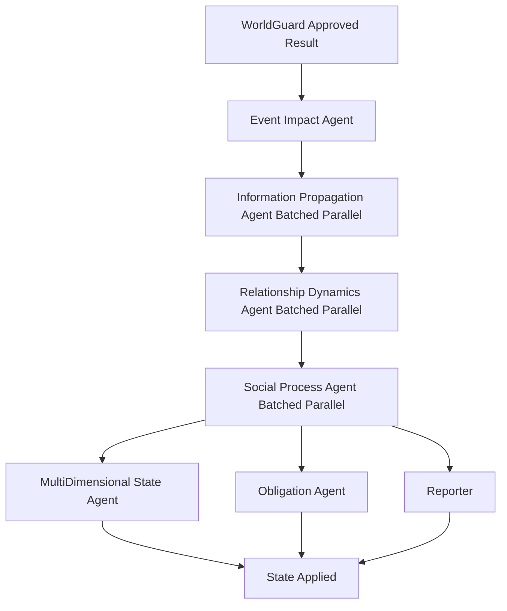
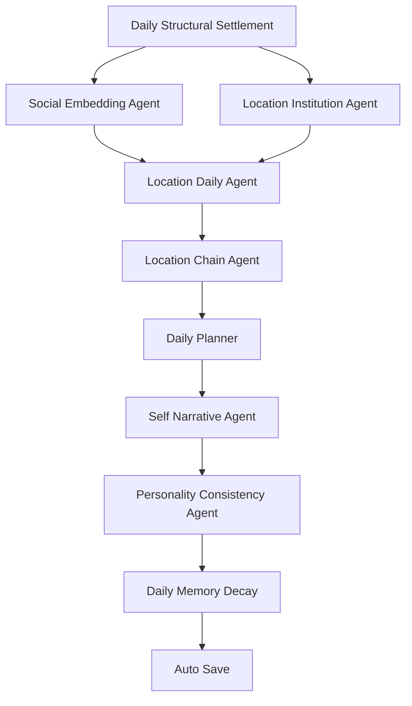

# AgentBox Town

[中文](README.md) | **English**

AgentBox Town is an experimental AI virtual town simulator. Each character lives inside an independent AgentBox with its own position, schedule, relationships, memories, needs, emotions, event queue, action process, and long-term personality state.

The project focuses on believable multi-agent town simulation rather than simple story generation. AI modules judge local decisions, while local guards enforce world rules, knowledge boundaries, movement, mortality, and persistence.

## Features

- Multi-agent virtual town with 100+ character support
- Per-character memory, relationships, emotions, needs, identity core, and long-term goals
- Weather, date, location institutions, location chains, and location runtime state
- Event propagation, relationship dynamics, social processes, obligations, and family sync
- Parallel AI task batching with configurable key pool and per-key concurrency
- Folder-based save system with per-character files and AG judgement files
- WorldGuard local validation to reduce hidden NPCs, omniscient knowledge, teleportation, and impossible actions

## Node Runtime Migration Status

Background runtime ownership has moved to Node. `node-core-v1` no longer depends on the browser loop for basic world progression, and it now runs a server-side AI action chain:

- Each step reads the save folder and selects candidate characters with need pressure, event queues, or unfinished processes.
- Node calls `Scheduler` to choose which characters act this round.
- Node calls `AgentAction` for selected characters in parallel, distributed through the key pool and per-key concurrency limit.
- `AgentAction` results are written back to character current tasks, emotions, memories, active processes, movement requests, and action records.
- After actions are applied, Node core advances virtual time, sleep, physiological decay, basic eating/care, movement arrival, and mortality checks.
- The background loop is serial: the next round is scheduled only after Scheduler, AgentAction, and Node tick have all completed.
- Pausing or stopping the background runtime cancels current AI retries so old requests do not keep the backend stuck.

`headless-browser-shim` remains as a compatibility fallback. Later stages can continue moving `NeedIntent / ContextRule / CrisisTriage / KnowledgeJudge / OutcomeJudge`, `StateSettlement`, information propagation, relationship dynamics, and social processes into pure Node.

## Main Interface

The main screen is a runnable town console, not just a chat window:

- Top controls: start, pause, reset, save, open settings, and show the per-cycle flow.
- Save manager: first launch opens the management screen; saves can be created, loaded, and deleted, with each save written to its own folder.
- Town map: shows locations and character positions. Location details, avatars, and weather are collapsed until selected to keep 100-person towns readable.
- Character panel: inspect position, life state, age, job, needs, multi-dimensional emotions, relationships, memories, long-term goals, active process, and event queue.
- Settings panel: configure AI base URL, model, key pool, per-key concurrency, batch size, virtual minutes per cycle, automatic interval, and per-Agent/per-character models.
- Status bar and call log: display model, key, Agent, duration, success/failure, retry wait, and cancellation state in real time.
- Per-cycle flow panel: can be opened or closed inside the UI to inspect which Agents run serially and which run in parallel.

## Per-Cycle Call Graph

GitHub renders the following Mermaid charts directly in the repository page. The call graph is split into smaller sections so GitHub's Mermaid renderer can lay it out reliably.

Main cycle:



Concurrency and retry:



Pre-judgement fan-in:



Event and post-action chain:



Midnight settlement:



## Run

Requirements:

- Windows is recommended for `start-ai-town-v2.cmd`
- Node.js 18 or newer
- No npm dependencies are required

```bat
start-ai-town-v2.cmd
```

Then open:

```text
http://localhost:8788/
```

LAN access:

- The launcher listens on `0.0.0.0` by default, and the server prints `LAN: http://your-pc-ip:8788`
- Open that LAN URL from a phone or another computer on the same Wi-Fi
- If it does not open, Windows Firewall is usually blocking it; allow Node.js on private networks or allow TCP port `8788`

Display and background runtime:

- Main UI: `http://localhost:8788/`, with full editing, settings, and simulation controls
- Display UI: `http://localhost:8788/ai-town-monitor.html`, which only reads saves and call status without running the simulation loop
- Node RuntimeController owns background state: `running`, `paused`, `stepping`, and `stopped`
- The display UI's start, pause, step, and stop buttons all call server-side Runtime APIs
- The current compute engine is `node-core-v1`: the server can now advance time, sleep, physiology, basic eating/care, movement arrival, and mortality checks directly, then write the save back
- `headless-browser-shim` remains as a compatibility fallback; later stages will move Scheduler, AgentAction, and post-Agent chains into pure Node

On first launch, configure your AI base URL, model, and API keys in the app settings.

Local AI is supported when the server exposes an OpenAI-compatible `/v1/chat/completions` API:

- Ollama: use `http://localhost:11434/v1`, with an installed model such as `qwen2.5:7b`
- LM Studio: usually `http://localhost:1234/v1`, with the currently loaded model name
- vLLM / llama.cpp server: use the corresponding OpenAI-compatible `/v1` base URL and model name

For `localhost`, LAN, and `.local` base URLs, API keys may be left empty. The server treats local AI as one virtual key pool and still applies the per-key concurrency limit.

Manual startup:

```bash
npm start
```

## Configuration

There are two supported configuration paths.

In-app configuration:

- Open `http://localhost:8788/`
- Open settings
- Fill in AI base URL, model, API keys, concurrency, tick interval, and batch size
- For local AI such as Ollama or LM Studio, the API key field can stay empty
- The server writes `ai-town-config.json`

Environment variables:

- Copy `.env.example` only as a reference; the server does not auto-load `.env`
- Start manually with `npm start` or `node ai-town-v2-server.js`
- `start-ai-town-v2.cmd` intentionally clears inherited AI environment variables so a fresh checkout opens in setup mode

Important local files:

- `ai-town-config.json` - generated local AI settings; ignored by Git
- `saves/` - local save folders inside the project directory; ignored by Git
- `.env` and `.env.local` - optional private environment files; ignored by Git

Saves are fixed to the `saves/` directory beside `ai-town-v2-server.js`. For example, when running from the repository root, saves are written to `./saves/`.

Main environment variables:

| Name | Purpose | Default |
| --- | --- | --- |
| `AI_TOWN_V2_PORT` | Local server port | `8788` |
| `AI_TOWN_V2_HOST` | Bind address; `0.0.0.0` allows LAN access | `0.0.0.0` |
| `AI_TOWN_API_KEYS` | Comma/newline/semicolon separated AI keys; can be empty for local AI | empty |
| `AI_TOWN_BASE_URL` | OpenAI-compatible base URL | `https://api.openai.com/v1` |
| `AI_TOWN_MODEL` | Default model | `gpt-4.1-mini` |
| `AI_TOWN_MAX_CONCURRENT_PER_KEY` | Per-key request concurrency | `20` |
| `AI_TOWN_TIMEOUT_MS` | Upstream request timeout | `180000` |
| `AI_TOWN_MAX_REQUEST_BODY_BYTES` | Max local API body size | `10000000` |
| `AI_TOWN_RETRY_DELAY_MS` | Retry wait for temporary upstream errors | `1000` |

Never commit real API keys.

## Main Files

- `ai-town-v2.html` - frontend UI and simulation loop
- `ai-town-v2-server.js` - local Node.js API server and AI proxy
- `start-ai-town-v2.cmd` - Windows launcher
- `package.json` - Node.js scripts and engine requirement
- `.env.example` - optional environment variable reference
- `ai-town-config.example.json` - local config file reference
- `AI虚拟小镇V2项目说明.md` - project design notes

## Notes

This is a local demo and research prototype. It is not production hardened. AI outputs are constrained by prompts and local validation, but the simulator still depends on model quality and configured API reliability.
