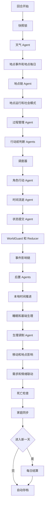
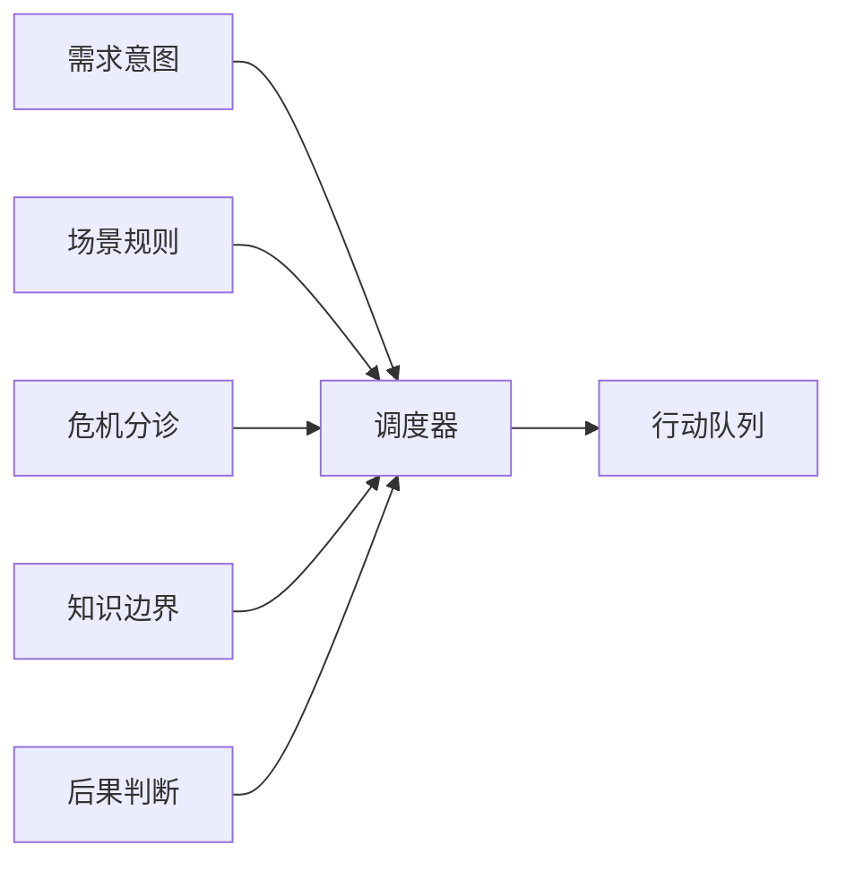
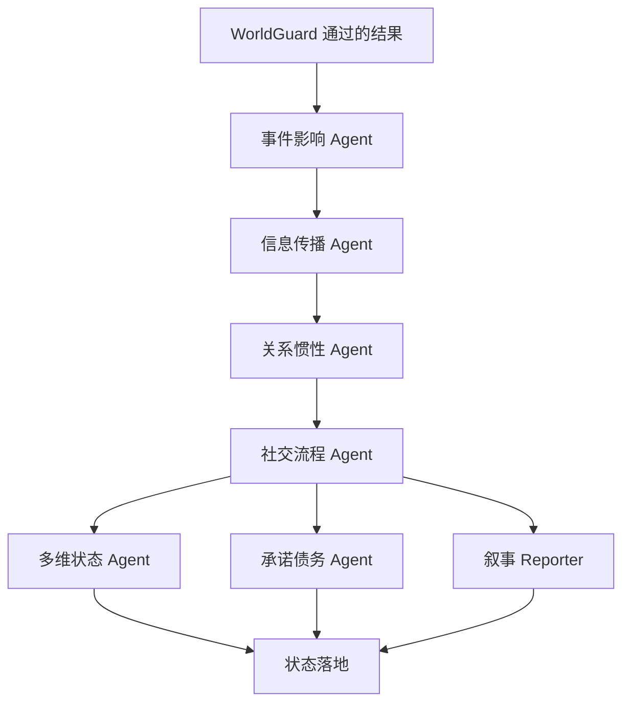
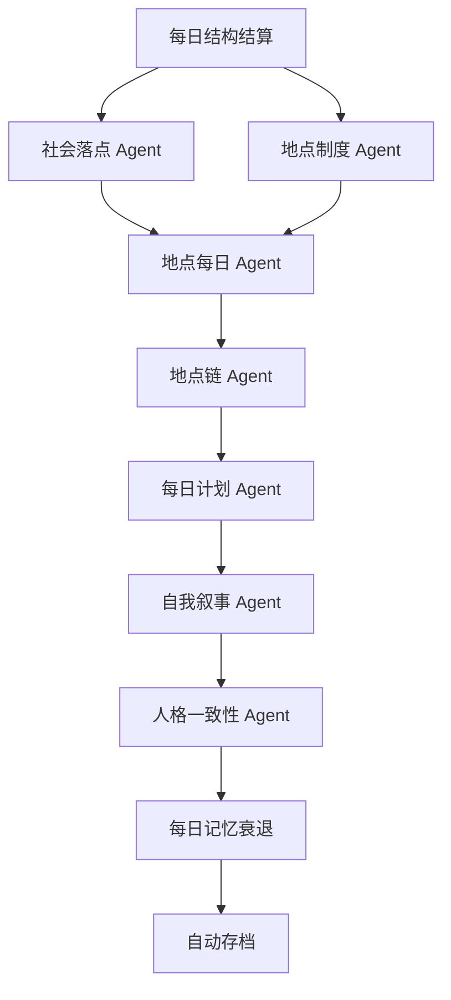

# AgentBox Town

**中文** | [English](README.en.md)

AgentBox Town 是一个实验性的 AI 虚拟小镇模拟器。每个角色都生活在独立的 AgentBox 里，拥有自己的位置、日程、关系、记忆、需求、情绪、事件队列、行动过程和长期人格状态。

这个项目关注“像真实小镇一样运行”的多智能体模拟，而不是单纯生成剧情。AI 模块负责局部判断，本地规则负责强约束：世界状态、知识边界、移动、死亡、存档和越权审查都由本地系统兜底。

## 功能

- 支持 100+ 角色的小镇模拟
- 每个角色拥有记忆、关系、多维情绪、需求、人格核心和长期目标
- 支持日期、天气、地点制度、地点链和地点运行状态
- 支持事件传播、关系惯性、社交流程、承诺债务和家庭同步
- 支持多 Key 分流、分批并发和每个 Agent/模块单独设置模型
- 存档以文件夹保存，包含角色文件和 AG 判断文件
- WorldGuard 本地审查，限制隐藏 NPC、全知信息、瞬移、越权死亡和不可能行动

## 每回合调用图表

GitHub 会直接渲染下面的 Mermaid 图表。为了避免 GitHub 的 Mermaid 布局器报错，调用图被拆成几个小图。

主循环：



行动前判断：



事件和行动后处理：



0 点日结：



## 运行

环境要求：

- 推荐 Windows，用 `start-ai-town-v2.cmd` 启动
- Node.js 18 或更高版本
- 不需要安装 npm 依赖

```bat
start-ai-town-v2.cmd
```

然后打开：

```text
http://localhost:8788/
```

首次打开后，在应用设置里填写 AI 地址、模型和 API Key。

也可以手动启动：

```bash
npm start
```

## 配置

项目支持两种配置方式。

应用内配置：

- 打开 `http://localhost:8788/`
- 进入设置
- 填写 AI 地址、模型、API Key、并发数、回合间隔和分批大小
- 服务端会写入本地 `ai-town-config.json`

环境变量配置：

- `.env.example` 只是参考文件，服务端不会自动读取 `.env`
- 如需用环境变量，手动运行 `npm start` 或 `node ai-town-v2-server.js`
- `start-ai-town-v2.cmd` 会故意清空继承的 AI 环境变量，让新仓库首次打开进入配置模式

重要本地文件：

- `ai-town-config.json`：本地 AI 设置，已被 Git 忽略
- `saves/`：项目当前目录下的本地存档文件夹，已被 Git 忽略
- `.env` 和 `.env.local`：可选私有环境文件，已被 Git 忽略

存档路径固定为 `ai-town-v2-server.js` 所在目录下的 `saves/`。例如在仓库根目录运行时，存档会写入 `./saves/`。

主要环境变量：

| 名称 | 用途 | 默认值 |
| --- | --- | --- |
| `AI_TOWN_V2_PORT` | 本地服务端口 | `8788` |
| `AI_TOWN_API_KEYS` | AI Key 列表，可用逗号、分号或换行分隔 | 空 |
| `AI_TOWN_BASE_URL` | OpenAI 兼容接口地址 | `https://api.openai.com/v1` |
| `AI_TOWN_MODEL` | 默认模型 | `gpt-4.1-mini` |
| `AI_TOWN_MAX_CONCURRENT_PER_KEY` | 每个 Key 的并发上限 | `20` |
| `AI_TOWN_TIMEOUT_MS` | 上游请求超时时间 | `180000` |
| `AI_TOWN_MAX_REQUEST_BODY_BYTES` | 本地接口请求体上限 | `10000000` |
| `AI_TOWN_RETRY_DELAY_MS` | 临时上游错误重试等待 | `300` |

不要提交真实 API Key。

## 主要文件

- `ai-town-v2.html`：前端界面和模拟循环
- `ai-town-v2-server.js`：本地 Node.js 服务端和 AI 代理
- `start-ai-town-v2.cmd`：Windows 启动脚本
- `package.json`：Node.js 脚本和版本要求
- `.env.example`：环境变量参考
- `ai-town-config.example.json`：本地配置参考
- `AI虚拟小镇V2项目说明.md`：项目设计说明

## 说明

这是本地 Demo 和研究原型，不是生产级系统。AI 输出会受到提示词和本地审查约束，但模拟质量仍依赖模型能力和接口稳定性。
