# AgentBox Town

AgentBox Town is an experimental AI virtual town simulator. Each character lives inside an independent AgentBox with its own position, schedule, relationships, memories, needs, emotions, event queue, action process, and long-term personality state.

The project focuses on believable multi-agent town simulation rather than simple story generation. AI modules judge local decisions, while local guards enforce world rules, knowledge boundaries, movement, mortality, and persistence.

## Features

- Multi-agent virtual town with 100+ character support
- Per-character memory, relationships, emotions, needs, identity core, and long-term goals
- Weather, date, location institutions, location chains, and location runtime state
- Event propagation, relationship dynamics, social processes, obligations, and family sync
- Parallel AI task batching with configurable key pool and per-key concurrency
- Folder-based save system with per-character files and AG judgement files
- WorldGuard local validation to reduce hidden NPCs, omniscient knowledge, teleportation, and impossible actions

## Per-Cycle Call Graph

GitHub renders the following Mermaid chart directly in the repository page.

```mermaid
flowchart TB
  Start(["Start cycle / 进入一回合"])
  Lock["Entrance lock\n防重复推进 + 快照"]
  Weather["WeatherAgent\n日期 / 农历 / 天气"]

  Start --> Lock --> Weather

  subgraph PlacePrep["地点前置并行"]
    LocationEvent["LocationEventAgent\n地点可见小事件"]
    LocationDaily["LocationDailyAgent\n地点今日重点"]
  end

  Weather --> LocationEvent
  Weather --> LocationDaily
  LocationEvent --> LocationChain["LocationChainAgent\n地点连续事件链"]
  LocationDaily --> LocationChain

  subgraph RuntimePrep["运行态并行"]
    LocationRuntime["LocationRuntimeAgent\n人群 / 队列 / 岗位 / 资源"]
    SocialPattern["SocialPatternAgent\n家庭 / 群体 / 关系压力"]
  end

  LocationChain --> LocationRuntime
  LocationChain --> SocialPattern
  LocationRuntime --> ProcessManager["ProcessManagerAgent\n推进未完成行动过程"]
  SocialPattern --> ProcessManager

  subgraph PreJudge["行动前判断：5 类并行分批"]
    NeedIntent["NeedIntentAgent\n当前主需求 / 动机"]
    ContextRule["ContextRuleAgent\n时间 / 地点 / 身份规则"]
    CrisisTriage["CrisisTriageAgent\n健康 / 安全 / 饥饿打断"]
    KnowledgeJudge["KnowledgeJudgeAgent\n角色知道 / 不知道"]
    OutcomeJudge["OutcomeJudgeAgent\n身份 + 严重度 + 后续去向"]
  end

  ProcessManager --> NeedIntent
  ProcessManager --> ContextRule
  ProcessManager --> CrisisTriage
  ProcessManager --> KnowledgeJudge
  ProcessManager --> OutcomeJudge

  NeedIntent --> Scheduler["Scheduler\n选择本轮谁行动"]
  ContextRule --> Scheduler
  CrisisTriage --> Scheduler
  KnowledgeJudge --> Scheduler
  OutcomeJudge --> Scheduler

  Scheduler --> AgentAction["AgentAction\n角色主观行动 / 过程片段"]
  AgentAction --> TimePassage["TimePassageAgent\n耗时 / 余时 / 是否完成"]
  TimePassage --> StateSettlement["StateSettlementAgent\n行动后状态补丁建议"]
  StateSettlement --> WorldGuard["WorldGuard + Reducer\n知识边界 / 地点 / 隐形 NPC / 移动 / 死亡审查"]

  subgraph EventBranch["事件影响链"]
    EventImpact["EventImpactAgent\n谁被事件影响"]
    InfoFlow["InformationPropagationAgent\n消息如何有限传播"]
    RelationDynamics["RelationshipDynamicsAgent\n信任 / 亲密 / 怨气慢变量"]
    SocialProcess["SocialProcessAgent\n误会 / 冲突 / 澄清 / 和解"]
  end

  WorldGuard --> EventImpact --> InfoFlow --> RelationDynamics --> SocialProcess

  subgraph PostAgents["后置并行 Agent"]
    MultiState["MultiDimensionalStateAgent\n多维情绪 / 需求 / 关系统合"]
    Obligation["ObligationAgent\n承诺 / 任务债务抽取"]
    Reporter["Reporter\n日志摘要"]
  end

  SocialProcess --> MultiState
  SocialProcess --> Obligation
  SocialProcess --> Reporter

  MultiState --> LocalAdvance["Local time advance\n推进虚拟时间"]
  Obligation --> LocalAdvance
  Reporter --> LocalAdvance

  LocalAdvance --> Sleep["Sleep / BasicLife\n睡眠 + 基础生理"]
  Sleep --> TimeDecay["TimeDecayAgent\n因人而异的生理调制"]
  TimeDecay --> Movement["Movement\n路线移动 / 到达判断"]
  Movement --> LocationInfluence["LocationInfluence\n地点状态影响角色"]
  LocationInfluence --> Coupling["Need / Emotion Coupling\n需求与情绪联动"]
  Coupling --> Mortality["Mortality\n死亡检查"]
  Mortality --> FamilySync["FamilySyncAgent\n晚间家庭同步"]
  FamilySync --> DayCheck{"跨到新的一天？"}

  DayCheck -- "No" --> Save["AutoSave\n写入存档文件夹"]
  DayCheck -- "Yes" --> DailySettlement["DailyStructuralSettlement\n本地日结"]

  subgraph DailyAgents["0 点日结 Agent"]
    SocialEmbedding["SocialEmbeddingAgent\n住所 / 邻里 / 圈子补齐"]
    LocationInstitution["LocationInstitutionAgent\n地点制度刷新"]
    DailyPlanner["DailyPlanner\n明日动态计划"]
    SelfNarrative["SelfNarrativeAgent\n角色自我叙事"]
    Personality["PersonalityConsistencyAgent\n人格核心小幅稳定"]
    MemoryDecay["DailyMemoryDecay\n每日记忆衰退"]
  end

  DailySettlement --> SocialEmbedding
  DailySettlement --> LocationInstitution
  SocialEmbedding --> DailyPlanner
  LocationInstitution --> DailyPlanner
  DailyPlanner --> SelfNarrative
  SelfNarrative --> Personality
  Personality --> MemoryDecay
  MemoryDecay --> Save
```



## Run

```bat
start-ai-town-v2.cmd
```

Then open:

```text
http://localhost:8788/
```

On first launch, configure your AI base URL, model, and API keys in the app settings.

## Configuration

`ai-town-config.json` is intentionally ignored by Git because it may contain API keys.

Use `ai-town-config.example.json` as a reference only. Do not commit real keys.

## Main Files

- `ai-town-v2.html` - frontend UI and simulation loop
- `ai-town-v2-server.js` - local Node.js API server and AI proxy
- `start-ai-town-v2.cmd` - Windows launcher
- `AI虚拟小镇V2项目说明.md` - project design notes

## Notes

This is a local demo and research prototype. It is not production hardened. AI outputs are constrained by prompts and local validation, but the simulator still depends on model quality and configured API reliability.
